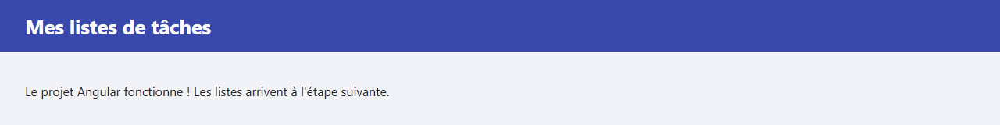

# Étape 01 : créer le projet

**Objectif** : créer une application Angular, la lancer dans le navigateur et comprendre à quoi servent les fichiers produits.

À la fin de l'étape, la page affiche seulement un titre. Il n'y a encore ni listes ni serveur, mais tout le projet est en place.



## Lancer cette étape

Depuis la racine du cours :

```sh
cd 01-creer-le-projet
npm install      # une seule fois : télécharge les dépendances dans node_modules/
npm start        # compile l'application et lance le serveur de développement
```

Ouvrez <http://localhost:4200>. `Ctrl+C` dans le terminal arrête le serveur de développement.

## Comment le projet a été créé

Le projet a été généré par l'**Angular CLI**, l'outil en ligne de commande d'Angular :

```sh
npx @angular/cli@22 new todolist --directory 01-creer-le-projet --skip-git --style=css --ssr=false --routing=false --skip-tests --ai-config=none
```

| Morceau de la commande           | Signification                                                                            |
| -------------------------------- | ---------------------------------------------------------------------------------------- |
| `npx @angular/cli@22`            | Télécharge et lance l'Angular CLI version 22, sans l'installer sur le poste.             |
| `new todolist`                   | Crée un nouveau projet appelé `todolist`.                                                |
| `--directory 01-creer-le-projet` | … dans ce dossier.                                                                       |
| `--skip-git`                     | Ne crée pas de dépôt Git : le dépôt, c'est tout le cours, à la racine.                   |
| `--style=css`                    | Styles en CSS classique.                                                                 |
| `--ssr=false`                    | Pas de rendu côté serveur : l'application est construite entièrement dans le navigateur. |
| `--routing=false`                | Pas de routeur : notre application tient sur une seule page.                             |
| `--skip-tests`                   | Pas de fichiers de tests, pour rester concentré sur l'essentiel.                         |
| `--ai-config=none`               | Pas de fichiers de configuration pour les assistants de code IA.                         |

La CLI a ensuite lancé `npm install` pour télécharger les dépendances.

Puis le projet a été simplifié :

- la page de démonstration géante de `app.html` a été remplacée par un simple titre ;
- la page est passée en français (`lang="fr"` et `<title>` dans `index.html`) ;
- `tsconfig.spec.json` et le script `npm test` ont été retirés, puisqu'il n'y a pas de tests ;
- le dossier `.vscode/` a été retiré : on ouvre plutôt la racine du cours dans VS Code ;
- des commentaires expliquent chaque fichier de `src/`.

## Les fichiers du projet

| Fichier ou dossier                   | Rôle                                                                                     |
| ------------------------------------ | ---------------------------------------------------------------------------------------- |
| `package.json`                       | Les dépendances (bibliothèques utilisées) et les scripts : `npm start`, `npm run build`. |
| `package-lock.json`                  | Les versions exactes installées. Ne se modifie jamais à la main.                         |
| `node_modules/`                      | Les dépendances téléchargées. Recréé par `npm install`, ignoré par Git.                  |
| `angular.json`                       | La configuration de la CLI : comment compiler et servir le projet.                       |
| `tsconfig.json`, `tsconfig.app.json` | Les réglages du compilateur TypeScript.                                                  |
| `.editorconfig`, `.prettierrc`       | Les règles de mise en forme du code (indentation, fins de ligne, guillemets…).           |
| `.gitignore`                         | Les fichiers que Git doit ignorer.                                                       |
| `public/`                            | Les fichiers copiés tels quels, comme l'icône `favicon.ico`.                             |
| `src/index.html`                     | L'unique page HTML de l'application.                                                     |
| `src/main.ts`                        | Le point d'entrée : il démarre Angular.                                                  |
| `src/styles.css`                     | Les styles globaux, valables pour toute la page.                                         |
| `src/app/app.config.ts`              | La configuration de l'application.                                                       |
| `src/app/app.ts`                     | Le composant racine `App` : sa classe TypeScript…                                        |
| `src/app/app.html`                   | … son gabarit HTML…                                                                      |
| `src/app/app.css`                    | … et ses styles.                                                                         |

## Comment l'application démarre

```text
index.html            le navigateur charge la page, qui contient la balise <app-root>
   │
   ▼
main.ts               bootstrapApplication(App, appConfig) démarre Angular
   │
   ▼
App (app.ts)          le composant dont le selector est 'app-root'
   │
   ▼
app.html + app.css    remplacent la balise <app-root> dans la page
```

## Les notions de l'étape

**Composant** : un morceau d'interface réutilisable. Il associe une classe TypeScript (les données), un gabarit HTML (l'affichage) et des styles CSS. Le décorateur `@Component({...})` placé au-dessus de la classe indique où trouver le gabarit et les styles, et sous quelle balise afficher le composant (`selector`).

**Interpolation** : dans un gabarit, `{{ title }}` affiche la valeur de la propriété `title` de la classe.

**Styles globaux ou styles de composant** : `src/styles.css` s'applique à toute la page. `app.css` ne s'applique qu'au composant `App` : Angular l'isole automatiquement.

**Serveur de développement** : `npm start` (qui lance `ng serve`) compile le projet puis le recompile à chaque enregistrement d'un fichier. La page se recharge toute seule.

## À essayer

1. Dans `src/app/app.ts`, changez la valeur de `title` puis enregistrez : la page se met à jour sans rien faire d'autre.
2. Ajoutez un paragraphe dans `src/app/app.html`.
3. Faites exprès une erreur, par exemple en supprimant une accolade `}` dans `app.ts`. Lisez le message dans le terminal et dans la page, puis corrigez.

## Étape suivante

[Étape 02 : afficher les listes](../02-afficher-les-listes/README.md)
