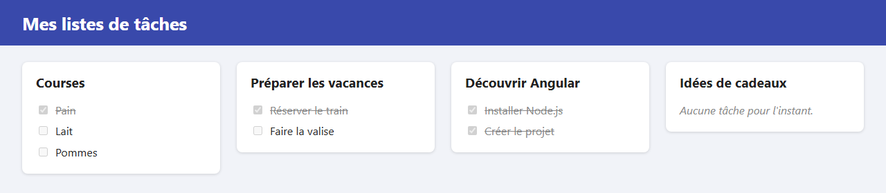

# Étape 02 : afficher les listes

**Objectif** : afficher plusieurs listes de tâches, avec leurs tâches. Une tâche réalisée apparaît cochée et barrée.

Pour l'instant, les données sont écrites directement dans le code et on ne peut encore rien modifier.



## Lancer cette étape

```sh
cd 02-afficher-les-listes
npm install      # une seule fois
npm start
```

Puis ouvrez <http://localhost:4200>.

## Ce qui a changé depuis l'étape 01

| Fichier            | Changement                                                               |
| ------------------ | ------------------------------------------------------------------------ |
| `src/app/todo.ts`  | **Nouveau** : les interfaces `Task` et `TodoList` décrivent nos données. |
| `src/app/app.ts`   | Les listes, rangées dans un signal `lists`.                              |
| `src/app/app.html` | Deux boucles `@for` affichent les listes et leurs tâches.                |
| `src/app/app.css`  | Les listes en grille de cartes ; une tâche réalisée est barrée.          |

## Les notions de l'étape

### Décrire les données : les interfaces

Dans `todo.ts`, une **interface** décrit la forme d'un objet :

```ts
export interface Task {
  id: number;
  title: string;
  done: boolean;
}
```

Si l'on écrit `titel` au lieu de `title`, ou `done: 'oui'` au lieu de `done: true`, l'éditeur souligne l'erreur tout de suite. Ces interfaces ont exactement la forme du JSON que renverra le serveur à l'étape 08 : rien à changer ce jour-là.

### Garder les données dans un signal

```ts
protected readonly lists = signal<TodoList[]>([ /* les listes */ ]);
```

Un **signal** est une boîte qui contient une valeur. On lit son contenu en l'appelant comme une fonction : `lists()`. Son intérêt apparaîtra à l'étape suivante : quand on change le contenu de la boîte, Angular met l'affichage à jour tout seul.

### Répéter un bloc : `@for`

```html
@for (list of lists(); track list.id) {
  <section class="card">…</section>
} @empty {
  <p>Aucune liste pour l'instant.</p>
}
```

- Le bloc est répété pour chaque élément du tableau. À l'intérieur, `list` désigne l'élément en cours.
- `track list.id` est obligatoire. Il dit à Angular comment reconnaître chaque élément (ici par son numéro unique), pour ne redessiner que ce qui a changé.
- Le bloc `@empty`, facultatif, s'affiche quand le tableau est vide.

Les boucles peuvent s'imbriquer : dans chaque carte, un second `@for` parcourt `list.tasks`.

### Lier une propriété : les crochets `[ ]`

```html
<label [class.done]="task.done">
  <input type="checkbox" [checked]="task.done" disabled />
  {{ task.title }}
</label>
```

- `[checked]="task.done"` : la propriété `checked` de la case prend la valeur de `task.done`.
- `[class.done]="task.done"` : la classe CSS `done` est ajoutée quand `task.done` est vrai, et retirée sinon. Dans `app.css`, `.done` barre et grise le texte.

Sans crochets, `checked="task.done"` serait un simple texte. Avec les crochets, c'est une **expression** TypeScript, évaluée par Angular.

## À essayer

1. Dans `app.ts`, ajoutez une tâche à la liste « Idées de cadeaux » : `{ id: 8, title: 'Un livre', done: false }`. Le message « Aucune tâche » disparaît.
2. Passez la tâche « Lait » à `done: true` : elle s'affiche cochée et barrée.
3. Remplacez tout le tableau par `[]` : le message « Aucune liste pour l'instant » s'affiche.
4. Retirez `track list.id` du `@for` et lisez l'erreur dans le terminal, puis remettez-le.

## Étape suivante

[Étape 03 : réagir aux clics](../03-reagir-aux-clics/README.md)
