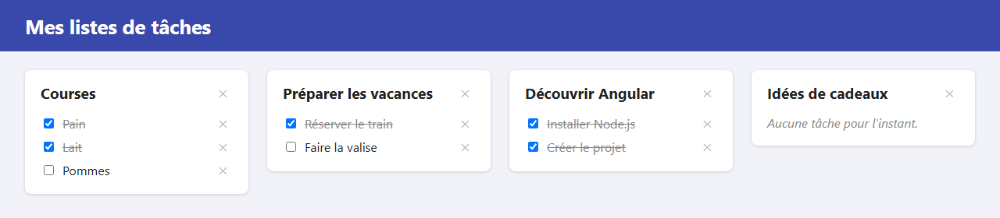

# Étape 03 : réagir aux clics

**Objectif** : rendre l'affichage vivant. Un clic sur une case coche ou décoche la tâche, qui se barre ou se débarre ; les boutons ✕ suppriment une tâche ou une liste entière.

Les données restent dans le code : si vous rechargez la page, tout revient comme au départ. Le serveur prendra le relais à l'étape 08.



## Lancer cette étape

```sh
cd 03-reagir-aux-clics
npm install      # une seule fois
npm start
```

Puis ouvrez <http://localhost:4200>.

## Ce qui a changé depuis l'étape 02

| Fichier            | Changement                                                                               |
| ------------------ | ---------------------------------------------------------------------------------------- |
| `src/app/app.ts`   | Trois méthodes, `toggleTask`, `deleteTask` et `deleteList`, modifient le signal `lists`. |
| `src/app/app.html` | Les cases ne sont plus `disabled` ; `(change)` et `(click)` appellent ces méthodes.      |
| `src/app/app.css`  | Style des boutons ✕ ; nom et bouton alignés sur une même ligne.                          |

## Les notions de l'étape

### Écouter un événement : les parenthèses `( )`

```html
<input type="checkbox" [checked]="task.done" (change)="toggleTask(list, task)" />
<button type="button" (click)="deleteTask(list, task)">✕</button>
```

`(click)="…"` veut dire : « quand l'événement `click` se produit sur cet élément, exécute ce code ». Ici, le code appelle une méthode de la classe, en lui passant la liste et la tâche de la ligne cliquée. `(change)` se déclenche quand on coche ou décoche une case.

Pour s'en souvenir :

| Syntaxe        | Sens                                       | Exemple                      |
| -------------- | ------------------------------------------ | ---------------------------- |
| `{{ valeur }}` | Affiche une valeur dans le texte.          | `{{ task.title }}`           |
| `[propriété]`  | TypeScript → HTML : lie une propriété.     | `[checked]="task.done"`      |
| `(événement)`  | HTML → TypeScript : réagit à un événement. | `(click)="deleteList(list)"` |

### Modifier un signal : `update`

```ts
this.lists.update((lists) => lists.filter((current) => current.id !== list.id));
```

`update` reçoit une fonction. Cette fonction reçoit la valeur actuelle du signal (toutes les listes) et renvoie la nouvelle (toutes les listes sauf celle qu'on supprime). Le signal range la nouvelle valeur et prévient Angular, qui redessine la page.

Il existe aussi `set(nouvelleValeur)`, qui remplace directement le contenu du signal.

### Ne jamais modifier, toujours copier

Pour cocher une tâche, on pourrait être tenté d'écrire `task.done = true`. Mais le signal contiendrait toujours le même tableau : pour lui, rien n'a changé, et il ne prévient pas ce qui dépend de lui. Selon les cas, l'affichage suivra quand même… ou pas : on le constatera à l'étape 06. La règle d'or est donc de **fabriquer des copies modifiées** au lieu de modifier les objets existants. Trois outils de JavaScript servent à cela :

| Outil                     | Ce qu'il fabrique                                                                  |
| ------------------------- | ---------------------------------------------------------------------------------- |
| `{ ...task, done: true }` | Une copie de `task` (les `...` recopient ses propriétés), avec `done` changé.      |
| `tableau.map(f)`          | Un nouveau tableau où chaque élément est remplacé par le résultat de `f`.          |
| `tableau.filter(f)`       | Un nouveau tableau qui ne garde que les éléments pour lesquels `f` renvoie `true`. |

La méthode privée `updateTasks` regroupe le travail commun aux deux méthodes sur les tâches : retrouver la bonne liste et la remplacer par une copie avec ses nouvelles tâches. Elle part toujours de la **valeur actuelle** du signal. L'objet `list` transmis par le gabarit peut en effet dater d'avant un autre changement, qu'on effacerait sans le vouloir. Ce détail comptera encore plus avec le serveur, dont les réponses arrivent en différé.

### Demander confirmation : `confirm`

`confirm('Supprimer… ?')` ouvre une boîte de dialogue du navigateur et renvoie `true` si l'utilisateur clique sur **OK**. Supprimer une liste entière mérite bien une confirmation.

## À essayer

1. Cochez puis décochez une tâche : le trait apparaît et disparaît.
2. Supprimez une tâche, puis toutes les tâches d'une liste : le message « Aucune tâche » réapparaît.
3. Supprimez une liste, cliquez sur **Annuler** dans la boîte de dialogue : rien ne change.
4. Rechargez la page (F5) : tout revient comme au départ, car les données sont écrites dans le code.

## Étape suivante

[Étape 04 : découper en composants](../04-decouper-en-composants/README.md)
