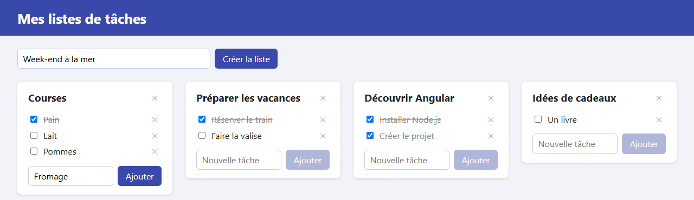

# Étape 05 : ajouter avec un formulaire

**Objectif** : créer une nouvelle liste en lui donnant un nom, et ajouter des tâches à chaque liste, grâce à des formulaires.

Les données restent dans le navigateur : un rechargement de la page efface toujours ce qu'on a créé.



## Lancer cette étape

```sh
cd 05-ajouter-avec-un-formulaire
npm install      # une seule fois
npm start
```

Puis ouvrez <http://localhost:4200>.

## Ce qui a changé depuis l'étape 04

| Fichier                            | Changement                                                                                    |
| ---------------------------------- | --------------------------------------------------------------------------------------------- |
| `src/app/app.ts`                   | `FormsModule` importé ; signal `newListName` ; méthodes `createList` et `addTask` ; `nextId`. |
| `src/app/app.html`                 | Formulaire « Nom de la nouvelle liste » ; `<app-list-card>` écoute la sortie `(addTask)`.     |
| `src/app/list-card/list-card.ts`   | `FormsModule` importé ; signal `newTaskTitle` ; sortie `addTask` ; méthode `submitTask`.      |
| `src/app/list-card/list-card.html` | Formulaire « Nouvelle tâche » en bas de la carte.                                             |
| `src/styles.css`                   | Styles partagés des champs (`.field`) et des boutons (`.button`).                             |
| `src/app/app.css`, `list-card.css` | Mise en page des deux formulaires.                                                            |

## Les notions de l'étape

### Le parcours d'une saisie

```text
on tape « Week-end »  ──[(ngModel)]──▶  signal newListName = 'Week-end'
                                             │
on appuie sur Entrée  ──(ngSubmit)───▶  createList()
                                             │  lit newListName(), crée la liste,
                                             │  l'ajoute au signal lists…
                                             ▼
                                        newListName.set('')  ──▶  le champ se vide
```

### Lier un champ dans les deux sens : `[(ngModel)]`

```html
<input type="text" name="name" [(ngModel)]="newListName" />
```

On a vu `[ ]` (du code vers la page) et `( )` (de la page vers le code). `[( )]` combine les deux : ce qu'on tape est rangé dans le signal `newListName`, et si le code change le signal, le champ suit. Cette syntaxe est parfois appelée « banane dans une boîte », à cause de la forme de `[( )]`.

`ngModel` vient du module `FormsModule`, qu'il faut ajouter aux `imports` du composant. Dans un `<form>`, chaque champ lié par `ngModel` doit avoir un attribut `name`.

### Envoyer un formulaire : `(ngSubmit)`

```html
<form (ngSubmit)="createList()">
  …
  <button type="submit">Créer la liste</button>
</form>
```

`(ngSubmit)` se déclenche au clic sur un bouton `type="submit"`, **ou** quand on appuie sur Entrée dans un champ. Sans Angular, envoyer un formulaire recharge la page ; `FormsModule` l'en empêche.

### Désactiver un bouton : `[disabled]`

```html
<button type="submit" [disabled]="!newListName().trim()">Créer la liste</button>
```

`trim()` retire les espaces au début et à la fin d'un texte. Un texte vide vaut « faux » en JavaScript ; le `!` inverse la condition. Le bouton est donc désactivé tant que le champ est vide ou ne contient que des espaces. Les méthodes `createList` et `submitTask` vérifient quand même le texte : un bouton désactivé ne protège pas de tout (la touche Entrée, par exemple).

### Pourquoi l'étape 04 était nécessaire

Chaque carte a son propre champ « Nouvelle tâche ». Comme chaque carte est un **exemplaire** distinct du composant `ListCard`, chacune a son propre signal `newTaskTitle` : ce qu'on tape dans une carte n'apparaît pas dans les autres. Avec tout dans `App`, il aurait fallu gérer un texte par liste à la main.

La carte transmet ensuite le titre au parent par sa nouvelle sortie : `addTask.emit(title)`. C'est toujours `App` qui modifie les données.

### Ajouter à un tableau sans le modifier

```ts
this.lists.update((lists) => [...lists, list]);
```

`[...lists, list]` fabrique un **nouveau** tableau : tous les éléments de `lists`, puis `list` à la fin. C'est la règle d'or de l'étape 03 : on ne modifie pas le tableau existant (avec `push`, par exemple), on en fabrique un nouveau.

### Donner un numéro aux nouveautés

Chaque liste et chaque tâche a besoin d'un `id` unique, ne serait-ce que pour `track`. Pour l'instant, le compteur `nextId` s'en charge : `this.nextId++` donne sa valeur actuelle, puis l'augmente de 1. À l'étape 08, c'est la base de données du serveur qui attribuera les numéros.

## À essayer

1. Créez une liste « Week-end », puis ajoutez-lui deux tâches, avec le bouton **Ajouter** puis avec la touche Entrée.
2. Tapez seulement des espaces dans un champ : le bouton reste désactivé.
3. Commencez à taper une tâche dans une carte : les champs des autres cartes restent vides.
4. Retirez `FormsModule` des `imports` d'`App` et lisez l'erreur : Angular ne connaît plus `ngModel`. Remettez-le.

## Étape suivante

[Étape 06 : barrer les listes terminées](../06-barrer-les-listes-terminees/README.md)
