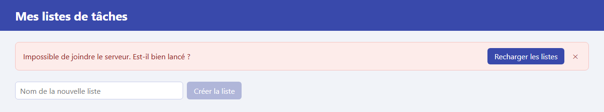

# Étape 09 : gérer le chargement et les erreurs

**Objectif** : dire à l'utilisateur ce qui se passe quand le serveur est lent ou ne répond pas. À l'étape 08, un serveur arrêté donnait une page vide, sans explication : désormais, un message l'annonce et propose de réessayer.

L'application est désormais utilisable. Comme à l'étape 08, elle travaille avec les routes « de test » du serveur, sans compte : les listes y sont communes à tous. Les étapes suivantes changent de façon de dialoguer avec le serveur (10), ajoutent des comptes (11), puis des tests (12).



## Lancer cette étape

Comme à l'étape 08, avec deux terminaux :

```sh
# Terminal 1 : le serveur
cd serveur
./mvnw compile exec:java        # ou .\mvnw.cmd compile exec:java sous Windows

# Terminal 2 : l'application
cd 09-gerer-le-chargement-et-les-erreurs
npm install      # une seule fois
npm start
```

Puis ouvrez <http://localhost:4200>.

## Ce qui a changé depuis l'étape 08

| Fichier                            | Changement                                                                                     |
| ---------------------------------- | ---------------------------------------------------------------------------------------------- |
| `src/app/todo-store.ts`            | Deux nouveaux signaux, `loading` et `error` ; chaque requête prévoit le cas d'échec.           |
| `src/app/app.html`                 | Bandeau d'erreur, message « Chargement des listes… », « Aucune liste » masqué en cas d'erreur. |
| `src/app/app.css`                  | Style du bandeau d'erreur.                                                                     |
| `src/app/list-card/list-card.html` | La case à cocher attend la confirmation du serveur avant de changer.                           |

## Les notions de l'étape

### Prévoir l'échec : `next` et `error`

```ts
this.http.get<TodoList[]>('/api/lists').subscribe({
  next: (lists) => { … },                    // la requête a réussi : lists est la réponse
  error: (error: HttpErrorResponse) => { … }, // elle a échoué : error décrit le problème
});
```

À l'étape 08, `subscribe` ne recevait qu'une fonction, appelée en cas de réussite. On lui passe maintenant un objet avec deux fonctions : `next` pour la réussite et `error` pour l'échec. Une seule des deux est appelée.

Une requête peut échouer pour deux grandes raisons :

| Cas                                       | Ce que reçoit `error`                               | Message affiché                                           |
| ----------------------------------------- | --------------------------------------------------- | --------------------------------------------------------- |
| Le serveur répond, mais refuse la requête | Code `400`, `404`… et le corps `{"error": "…"}`     | L'explication du serveur : « La tâche 3 n'existe pas. »   |
| Le serveur ne répond pas du tout (arrêté) | Code `502` (renvoyé par le proxy), sans explication | « Impossible de joindre le serveur. Est-il bien lancé ? » |

C'est le rôle de la méthode privée `showError`. Le détail technique reste affiché dans la console (F12), utile au développeur mais pas à l'utilisateur.

### L'état de l'écran, dans des signaux

Le service expose trois signaux en lecture seule : `lists`, `loading` et `error`. `App` n'a qu'à les lire pour choisir quoi afficher :

```html
@if (store.error(); as message) {
  <div class="error" role="alert">{{ message }} …</div>
}

@if (store.loading()) {
  <p>Chargement des listes…</p>
} @else {
  … les cartes …
}
```

`@if (store.error(); as message)` teste la valeur et lui donne un nom, `message`, utilisable dans le bloc. Un texte non vide vaut « vrai », `null` vaut « faux ».

`loading` passe à `true` au lancement de `load()` et revient à `false` à la réponse, qu'elle soit bonne ou mauvaise : il faut penser à le faire dans `next` **et** dans `error`, sinon « Chargement… » resterait affiché pour toujours.

### Ne pas afficher de faux message

En cas d'erreur de chargement, le tableau des listes est vide. Le bloc `@empty` afficherait alors « Aucune liste pour l'instant. Créez-en une ! », ce qui est faux : il y a peut-être des listes, on n'a simplement pas pu les lire. Un `@if (!store.error())` dans `@empty` évite ce message trompeur.

### Une case qui dit toujours la vérité

À l'étape 08, un clic sur une case la cochait immédiatement : c'est le comportement normal d'un navigateur. Mais si le serveur refuse ensuite la modification, la case reste cochée alors que rien n'a été enregistré, et elle ne se corrige plus d'elle-même : pour Angular, `task.done` n'a pas changé, il n'a donc rien à redessiner.

```html
<input
  type="checkbox"
  [checked]="task.done"
  (click)="$event.preventDefault(); toggleTask.emit(task)"
/>
```

`$event.preventDefault()` empêche le navigateur de cocher la case lui-même. Seul `[checked]="task.done"` la change, donc seulement quand le serveur a confirmé. On écoute désormais `(click)` et non plus `(change)`, car un clic annulé ne déclenche pas d'événement `change`.

## À essayer

1. **Serveur arrêté** : arrêtez le serveur (`Ctrl+C`) puis rechargez la page. Le bandeau rouge apparaît. Relancez le serveur, puis cliquez sur **Recharger les listes**.
2. **Serveur lent** : créez `serveur/.env` avec la ligne `DELAY_MS=3000` et relancez le serveur. Rechargez la page : « Chargement des listes… » s'affiche pendant 3 secondes. Cochez une tâche : la case attend la réponse pour se cocher. Supprimez ensuite le fichier `.env` et relancez le serveur.

   

3. **Refus du serveur** : ouvrez l'application dans deux onglets. Dans le premier, supprimez une tâche. Dans le second, où elle est toujours affichée, cochez-la : le serveur répond `404` et son message s'affiche. **Recharger les listes** remet l'onglet à jour.
4. Dans `todo-store.ts`, retirez `this.writableLoading.set(false);` de la fonction `error` de `load()`, arrêtez le serveur et rechargez la page : « Chargement des listes… » ne disparaît plus. Remettez la ligne.

## Étape suivante

[Étape 10 : synchroniser avec le serveur](../10-synchroniser-avec-le-serveur/README.md)
