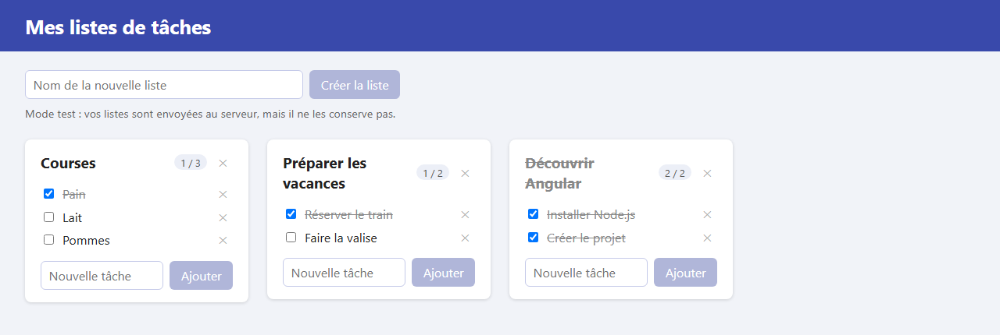

# Étape 10 : synchroniser avec le serveur

**Objectif** : changer de façon de dialoguer avec le serveur. Au lieu d'envoyer une requête par action (créer, cocher, supprimer…), l'application modifie ses listes tout de suite dans le navigateur, puis envoie **toutes** les listes au serveur d'un seul coup. C'est la **synchronisation**.

Cette étape utilise, comme les étapes 08 et 09, une route « de test », sans compte : le serveur y répond avec les **valeurs de départ** et accepte ce qu'on lui envoie, **sans le conserver**. Après un rechargement de la page, on retrouve donc les listes de départ. L'étape 11 ajoutera des comptes, pour que le serveur enregistre vraiment les listes.



## Lancer cette étape

Comme à l'étape 08, avec deux terminaux :

```sh
# Terminal 1 : le serveur
cd serveur
./mvnw compile exec:java        # ou .\mvnw.cmd compile exec:java sous Windows

# Terminal 2 : l'application
cd 10-synchroniser-avec-le-serveur
npm install      # si node_modules/ n'existe pas encore
npm start
```

Puis ouvrez <http://localhost:4200>.

## Ce qui a changé depuis l'étape 09

| Fichier                            | Changement                                                                                       |
| ---------------------------------- | ------------------------------------------------------------------------------------------------ |
| `src/app/todo-store.ts`            | Les actions modifient les listes localement puis appellent `sync()`, qui envoie tout au serveur. |
| `src/app/app.html`                 | Ligne d'état de la synchronisation ; le bouton du bandeau devient « Réessayer ».                 |
| `src/app/app.css`                  | Style de la ligne d'état.                                                                        |
| `src/app/list-card/list-card.html` | Seul le commentaire de la case à cocher change.                                                  |

Les composants n'ont pas changé : ils appellent toujours les mêmes méthodes du service. Une fois de plus, seul `TodoStore` sait comment on parle au serveur.

## Les notions de l'étape

### Deux façons de parler au serveur

| Étapes 08 et 09 : une requête par action            | Étape 10 : synchronisation                                                 |
| --------------------------------------------------- | -------------------------------------------------------------------------- |
| `POST /api/lists`, `PATCH /api/tasks/5`, `DELETE …` | `GET /api/sync` pour tout lire, `PUT /api/sync` pour tout envoyer          |
| L'affichage attend la réponse du serveur.           | L'affichage change tout de suite ; l'envoi suit.                           |
| Le serveur attribue les numéros (`id`).             | Le navigateur choisit les numéros.                                         |
| Chaque requête est petite.                          | Chaque envoi contient toutes les listes.                                   |
| Impossible de travailler sans serveur.              | On peut continuer à travailler si un envoi échoue : le suivant rattrapera. |

Aucune n'est meilleure dans l'absolu. La synchronisation est simple côté serveur et donne une application très réactive ; elle convient bien à des données de petite taille, qui appartiennent à un seul utilisateur, comme nos listes.

### Modifier d'abord, envoyer ensuite

```ts
toggleTask(list: TodoList, task: Task): void {
  this.updateTasks(list, (tasks) => …);   // 1. l'affichage change tout de suite
  this.sync();                            // 2. puis toutes les listes partent au serveur
}
```

`sync()` envoie le contenu du signal : `this.http.put('/api/sync', this.writableLists())`. `HttpClient` convertit le tableau de listes en JSON ; c'est exactement la forme des interfaces `TodoList` et `Task`.

### Le navigateur choisit les numéros

Une liste créée doit avoir un numéro tout de suite, sans attendre le serveur (ne serait-ce que pour le `track` du `@for`). La méthode `newId()` prend le plus grand numéro déjà utilisé, et ajoute 1 :

```ts
const ids = this.writableLists().flatMap((list) => [list.id, ...list.tasks.map((task) => task.id)]);
return Math.max(0, ...ids) + 1;
```

`flatMap` rassemble dans un seul tableau le numéro de chaque liste et ceux de ses tâches ; `Math.max(0, ...ids)` donne le plus grand, ou 0 s'il n'y en a aucun.

### Un envoi à la fois

Si l'on coche trois cases très vite, trois envois partiraient presque en même temps. Rien ne garantit qu'ils arrivent au serveur dans le bon ordre : un envoi ancien pourrait arriver en dernier et remplacer la version la plus récente. `sync()` s'en protège avec deux variables :

- `sending` : un envoi est en route. Un nouvel appel à `sync()` ne lance alors pas de requête…
- `changedWhileSending` : … il note seulement que les listes ont changé.

À la fin de l'envoi, `sendFinished()` regarde cette note et renvoie, si besoin, **l'état le plus récent**. Trois clics rapides donnent ainsi deux envois, et le dernier arrivé est toujours le plus à jour.

### Ne jamais envoyer avant d'avoir reçu

Tant que les listes n'ont pas été reçues du serveur, le signal contient un tableau vide. Si `sync()` l'envoyait, le serveur remplacerait les vraies listes par… rien. La variable `loaded` l'en empêche. Avec les routes de test, ce ne serait pas grave, puisque rien n'est conservé ; avec les comptes de l'étape 11, cela effacerait les listes de l'utilisateur.

### Réessayer ce qui a échoué

Le bouton du bandeau d'erreur appelle `retry()` : si les listes n'ont jamais été reçues, on les recharge ; sinon, c'est un envoi qui a échoué, et on renvoie les listes.

## À essayer

1. Ouvrez les outils de développement (**F12**), onglet **Réseau**, puis cochez une tâche. Une requête `PUT sync` apparaît. Son onglet **Charge utile** (_Payload_) montre toutes les listes envoyées.
2. Regardez le terminal du serveur : chaque envoi y est suivi de `(mode test : … liste(s) reçue(s), non enregistrée(s))`.
3. Rechargez la page : vos modifications ont disparu. Le serveur les a bien reçues, mais en mode test il ne garde rien.
4. Ralentissez le serveur (`DELAY_MS=1500` dans `serveur/.env`, puis relancez-le) et cochez plusieurs cases très vite. L'affichage suit immédiatement, « Envoi des listes au serveur… » s'affiche, et le terminal du serveur ne montre que deux `PUT`.
5. Arrêtez le serveur puis cochez une tâche : l'affichage change quand même et le bandeau d'erreur apparaît. Relancez le serveur et cliquez sur **Réessayer** : les listes repartent.

## Étape suivante

[Étape 11 : ajouter l'authentification](../11-ajouter-l-authentification/README.md)
