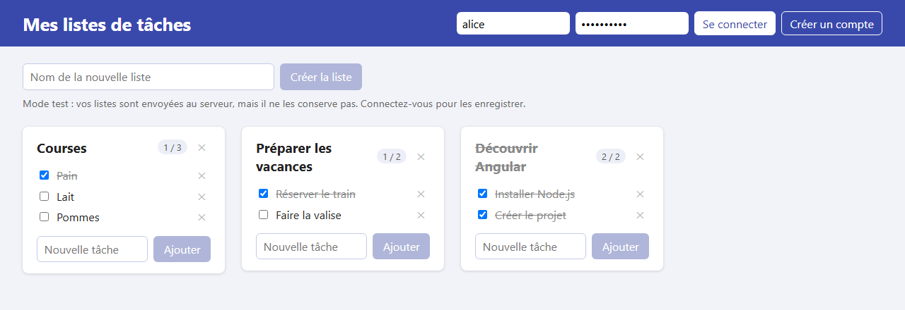
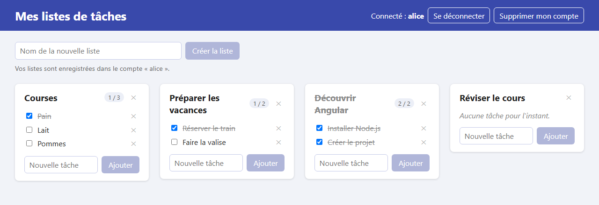

# Étape 11 : ajouter l'authentification

**Objectif** : permettre de créer un compte, de s'y connecter, de s'en déconnecter et de le supprimer. Une fois connecté, les listes sont **enregistrées dans le compte** : on les retrouve après un rechargement de la page, ou depuis un autre navigateur.

Sans compte, l'application fonctionne comme à l'étape 10 (mode test) : le serveur envoie les valeurs de départ et ne conserve rien.





## Lancer cette étape

```sh
# Terminal 1 : le serveur
cd serveur
./mvnw compile exec:java        # ou .\mvnw.cmd compile exec:java sous Windows

# Terminal 2 : l'application
cd 11-ajouter-l-authentification
npm install      # si node_modules/ n'existe pas encore
npm start
```

Puis ouvrez <http://localhost:4200>. Pour essayer, tapez un identifiant (3 à 30 lettres sans accent, chiffres, `.`, `-` ou `_`) et un mot de passe (8 caractères au moins), puis cliquez sur **Créer un compte**.

## Ce qui a changé depuis l'étape 10

| Fichier                                 | Changement                                                                                          |
| --------------------------------------- | --------------------------------------------------------------------------------------------------- |
| `src/app/auth-store.ts`                 | **Nouveau** : le service du compte (connexion, déconnexion, création, suppression) et le jeton.     |
| `src/app/auth-interceptor.ts`           | **Nouveau** : ajoute le jeton à chaque requête envoyée au serveur.                                  |
| `src/app/account-panel/`                | **Nouveau** : le composant `AccountPanel`, formulaire de connexion ou barre « Connecté ».           |
| `src/app/error-message.ts`              | **Nouveau** : la traduction des erreurs HTTP en messages, sortie de `TodoStore` pour être partagée. |
| `src/app/app.config.ts`                 | `provideHttpClient(withInterceptors([authInterceptor]))`.                                           |
| `src/app/todo-store.ts`                 | `sync()` devient publique ; une erreur 401 fait oublier la session.                                 |
| `src/app/app.ts`, `app.html`, `app.css` | Le panneau du compte dans l'en-tête ; la ligne d'état dit où vont les listes.                       |

## Côté serveur

Le serveur propose, en plus des routes de test, les routes des comptes :

| Requête                           | Corps envoyé               | Réponse                                                                                    |
| --------------------------------- | -------------------------- | ------------------------------------------------------------------------------------------ |
| `POST /api/accounts`              | `{"username", "password"}` | `201` + `{"token", "username"}` : compte créé et connecté · `400` · `409` identifiant pris |
| `POST /api/sessions`              | `{"username", "password"}` | `200` + `{"token", "username"}` · `401` identifiants incorrects                            |
| `DELETE /api/sessions/current` 🔒 |                            | `204` : le jeton n'est plus valable                                                        |
| `DELETE /api/accounts/me` 🔒      |                            | `204` : compte et listes supprimés                                                         |
| `GET /api/sync`                   | (🔒 facultatif)            | les listes du compte, ou les valeurs de départ sans jeton                                  |
| `PUT /api/sync`                   | (🔒 facultatif) les listes | `204` : enregistrées dans le compte, ou ignorées sans jeton                                |

🔒 : la requête doit porter l'en-tête `Authorization: Bearer <jeton>`. Le détail est dans [serveur/README.md](../serveur/README.md).

## Les notions de l'étape

### Le jeton de session

```text
1. POST /api/sessions {"username": "alice", "password": "…"}  ─────────▶  le serveur vérifie
                                               ◀─────────  {"token": "Xy7…", "username": "alice"}
2. GET /api/sync        + en-tête « Authorization: Bearer Xy7… »  ────▶  les listes d'alice
3. PUT /api/sync        + en-tête « Authorization: Bearer Xy7… »  ────▶  enregistrées pour alice
```

HTTP ne se souvient de rien d'une requête à l'autre. Pour savoir qui parle, le serveur remet donc, à la connexion, un **jeton** : une longue suite de caractères aléatoires, impossible à deviner. Le navigateur le présente ensuite à chaque requête, comme un badge. Le mot de passe, lui, n'est envoyé qu'une seule fois.

`AuthStore` garde ce jeton dans un signal et dans le **`localStorage`** du navigateur, une petite zone de stockage propre à chaque site, qui survit aux rechargements : on reste connecté en rouvrant la page.

### Ajouter le jeton partout : l'intercepteur

```ts
export const authInterceptor: HttpInterceptorFn = (request, next) => {
  const token = inject(AuthStore).token();
  if (token === null) {
    return next(request);
  }
  return next(request.clone({ setHeaders: { Authorization: `Bearer ${token}` } }));
};
```

Un **intercepteur** est une fonction par laquelle passent toutes les requêtes de `HttpClient`, juste avant leur départ. Celui-ci ajoute l'en-tête `Authorization` quand on est connecté. Une requête ne se modifie pas : `clone` en fabrique une copie modifiée.

Résultat : `TodoStore` n'a pas eu à changer ses requêtes. Il appelle toujours `GET` et `PUT /api/sync` ; c'est le serveur qui, selon la présence du jeton, répond en mode test ou avec le compte.

### Un service qui renvoie la requête

À l'étape 08, `TodoStore` s'abonnait lui-même à ses requêtes (`subscribe`). `AuthStore` fait autrement : `login` **renvoie** la requête, et c'est le composant qui s'y abonne :

```ts
// auth-store.ts
login(username: string, password: string): Observable<Session> {
  return this.http
    .post<Session>('/api/sessions', { username: username, password: password })
    .pipe(tap((session) => this.remember(session)));
}

// account-panel.ts
this.auth.login(this.username(), this.password()).subscribe({
  next: () => this.todos.load(),                                // connecté : on charge ses listes
  error: (error: HttpErrorResponse) => this.message.set(errorMessage(error)),
});
```

Un **`Observable`** représente une réponse à venir ; on s'y abonne pour être prévenu de son arrivée. Ici, le composant a besoin de savoir quand la connexion a réussi (pour charger les listes du compte) ou échoué (pour afficher « Identifiant ou mot de passe incorrect »).

`pipe(tap(…))` glisse une action sur le chemin de la réponse, avant qu'elle n'arrive au composant : le service range la session reçue, puis le composant fait la suite.

### Qui fait quoi à chaque action

| Action              | `AuthStore`                                 | puis `AccountPanel` demande à `TodoStore`…                      |
| ------------------- | ------------------------------------------- | --------------------------------------------------------------- |
| Se connecter        | envoie les identifiants, garde le jeton     | `load()` : afficher les listes du compte                        |
| Créer un compte     | idem, le serveur connectant aussitôt        | `sync()` : enregistrer dans ce compte neuf les listes affichées |
| Se déconnecter      | oublie le jeton, prévient le serveur        | `load()` : revenir aux valeurs de départ                        |
| Supprimer le compte | supprime côté serveur, puis oublie le jeton | `load()` : revenir aux valeurs de départ                        |

Si le serveur refuse un jeton (erreur **401** : session expirée au bout de 7 jours, compte supprimé depuis un autre onglet…), `TodoStore` demande à `AuthStore` de l'oublier et affiche « Session inconnue ou expirée : reconnectez-vous. »

### Sécurité : ce que fait le serveur

- Il n'enregistre jamais un mot de passe tel quel, seulement son **empreinte** (PBKDF2), calculée avec un « sel » aléatoire propre à chaque compte.
- Il ne garde que l'empreinte SHA-256 de chaque jeton : lire la base ne permet pas de se faire passer pour quelqu'un.
- Il répond « Identifiant ou mot de passe incorrect » dans les deux cas, sans dire lequel des deux est faux.

Limites, normales pour un projet d'apprentissage : tout circule en HTTP non chiffré (il faudrait HTTPS sur Internet), et un jeton rangé dans le `localStorage` est lisible par tout script de la page.

## À essayer

1. Modifiez les listes en mode test, puis créez un compte : vos listes sont enregistrées dans le compte. Rechargez la page : vous êtes toujours connecté, et vos listes sont là.
2. Déconnectez-vous : retour aux valeurs de départ. Reconnectez-vous : vos listes reviennent.
3. Essayez un mauvais mot de passe, puis un identifiant déjà pris (même avec d'autres majuscules) : lisez les messages du serveur.
4. Onglet **Réseau** (F12) : cliquez sur une requête `sync`, rubrique **En-têtes de requête** (_Request Headers_). Connecté, vous y voyez `Authorization: Bearer …` ; déconnecté, non.
5. Onglet **Application** (F12), **Stockage local** (_Local Storage_), `http://localhost:4200` : la clé `todolist-session` contient votre session. Remplacez le jeton par `n-importe-quoi` et rechargez la page : le serveur répond 401, et l'application vous déconnecte.
6. Ouvrez l'application dans deux navigateurs différents (ou une fenêtre de navigation privée), connectés au même compte. Modifiez une liste dans l'un, rechargez l'autre.

## Étape suivante

[Étape 12 : écrire des tests](../12-ecrire-des-tests/README.md)
